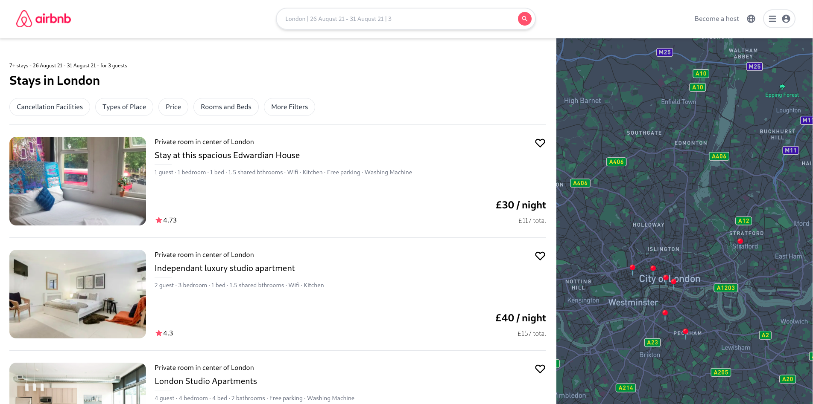

# Airbnb Clone

This project shows how to use [Tailwind CSS](https://tailwindcss.com/) [(v2.2)](https://blog.tailwindcss.com/tailwindcss-2-2) with Next.js. It follows the steps outlined in the official [Tailwind docs](https://tailwindcss.com/docs/guides/nextjs).

This project is hosted live at https://airbnb-vivekmalhan666.vercel.app/ .

## Available Scripts

In the project directory, you can run:

### The following Technologies were used to develop this application

    1. React js.
    2. Next js.
    3. Tailwind css.
    3. Server Side Rendering.
    4. Mapbox - custom maps.
    5. Page loaders.
    6. Css Animations.
    7. Calenders- React-date-range.
    8. Environment variables
